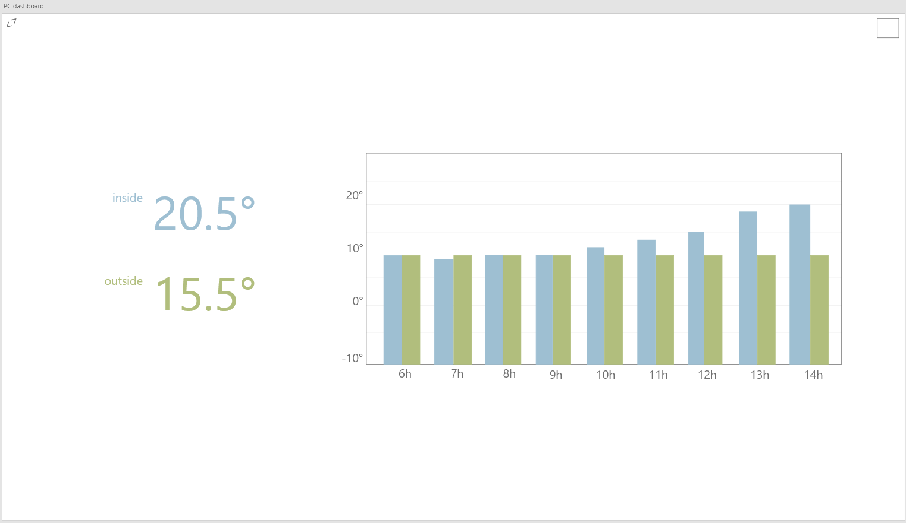

# Demotica-Dashboard: Dashboard Design | How to make a clean yet informative Dashboard to display temperature info?
In this document I will use the DOT research framework in order to establish a good dashboard design for my project. 

## What dashboard designs have other people made?
In order to make a dashboard myself, I need an understanding of how other people tackled this problem. In order to aquire this knowledge I will analyze available products from google searches.
### Dashboard on hardware

>Vervloesem, K. (2021, 18 januari). Zo maak je een eenvoudig dashboard voor je domoticasysteem. computertotaal.nl. https://computertotaal.nl/artikelen/internet-thuis/zo-maak-je-een-eenvoudig-dashboard-voor-je-domoticasysteem/

The source, found through google, is a tutorial for making a raspberry pi with a display that acts as a dashboard for a MQTT broker. This kind of dashboard is one that runs on a device dedicated to displaying that dashboard. the upside to this is that it is a lot cheaper to produce and can be more throughly costumized. 

 

### Android Dashboard application

>Habit Automated LLC. (2021, 28 november). HomeHabit - Smart Home Dashboard. play.google.com. https://play.google.com/store/apps/details?id=app.homehabit.view&hl=nl&gl=US

The source leads to an playstore app that allows the user to create their own dashboard using within the app. The dashboard can be made up to the user own specs using multiple popular integrations like MQTT, home assistant, Domoticz and more. A common theme among dashboards is that they are very costumizable, as shown by my source 

 
### In conclusion
There are a lot diffrent ways to make a demotica dashboard, almost all of them are customizable. Most of Dasboards take the form of a piece of hardware dedicated to displaying said dashboard, or are mobile applications.  The most important thing that all dashboards had in common however, was the way they displayed data. no mattar how you choose to implement a dashboard, you always need to make sure the data you are handling is being displayed in such a way that the user immediately understands it.
 

## What are some good dashboard guidelines?
>dashboard design examples that catch the eye. (z.d.). eleken.co. https://www.eleken.co/blog-posts/dashboard-design-examples-that-catch-the-eye

In order to start working on a design, I first need to know what makes a dashboard a good dashboard. 
Following a Literature study, I have compiled the following set of rules that can be apllied to mesure a dashboards efficiency:
1. Five-second rule:  It should take no more than five seconds for the user to find the most important information on the dashboard.
2. Clear and logical layout: Divide all the information into three parts in descending order of importance.
3. Display only key metrics: Do not overwhelm the user with too many details.
4. Visualize data in an appropriate way: You should organize all the information to make it easy to understand.
 
These rules all seem pretty straight forward, they are however very important for making a good dashboard. 
In summary: Keep it simple and focus on whats important

## What are my dashboard requirements?
before I start working on possible wireframe designs, I will have to sum up my dashboard requirements. it would be very difficult to start designing something without knowing what it's supposed to be able to do.
The requirements are as follows:
1. The dashboard must display inside the temperature acurate to 10 seconds
2. The dashboard should have a fullscreen mode for dedicated tablets and dedicated monitoring devices
3. The dashboard should display a graph with averages from previous data such as:
  1. Average from previous hours 
  2. Average from previous minutes
  3. Average from previous days
4. The dashboard should have settings where one can change both graph and temperature display settings.
5. The dashboard should be able to switch to darkmode for oled devices
6. The Dashboard Must show the outside temperature.

## Designs
The following are some designs I made based on the previous research. These designs will be shown to possible users and experts in order to gain feedback for further improvements.

### Design 1
Design 1 are the original designs i made for Mobile devices and desktop counterparts.
#### Mainpage
On the main page I have only put the essentials. you can see the indoor, outdoor and graph along with a fullscreen and settings button.
On a side note, the cube in the top left is supposed to be a cog wheel.

#### Settings
In the setting I have put some more technical settings regarding api call intervals.
Same as with the mainpage, the button on the top left is supposed to be the back button with a back arrow.
The settings page doesnt have to many configurable settings, but he options it does contain are mostly related to api calls.

  
An alternation on the first design using dropdowns instead of buttons. this one could also be applied to the desktop if popular.

 

### Design 2
After having gatherd valuable feedback from users.

#### Mainpage
The most noticible change from the first design is the colouring. This was done to bale to use one graph for 2 types of data. 
For the desktop variant it became clear that the graph had some unclear data. Both X and Y axis had number, but what do they mean? In order to remedy this, I will ad both celcius icon and time identifiers  
The mobile varient had a diffrent yet similar issue, the graph just wasn't graph like at all. This was worked on when i added the second graph.

#### Settings
the settings page remains largely unchainged. I have dropped the second mobile design in favor of the first.
