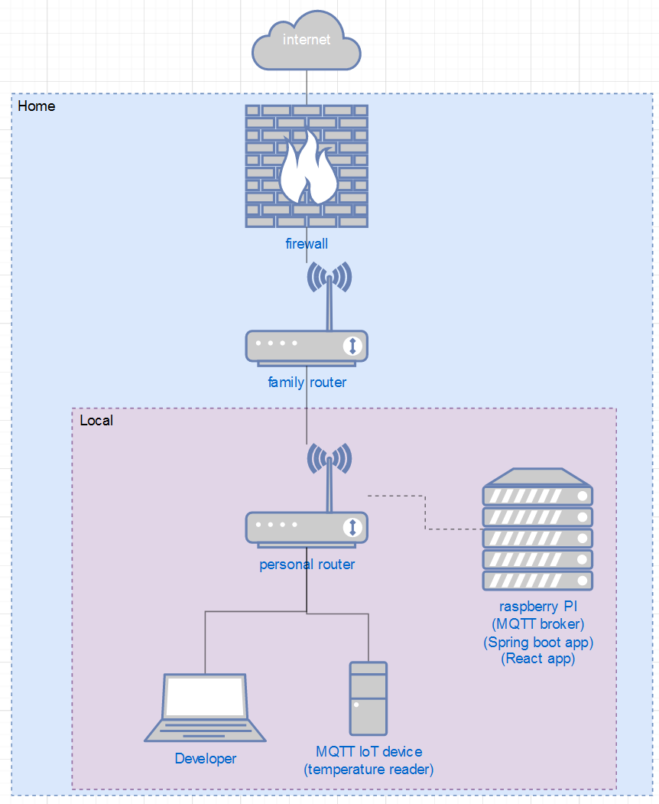

# Which hosting methods are best suited for my project components?
In this document I am going to to see what it takes to both host parts of my application online as safe as possible.
The image below shows what the current network looks like. 
 
As is shown in the diagram, there are about 4 services that are comunicating with eachother to make this app work: the IOT device, the MQTT broker, the Springboot REST service and the React frontend app. I believe I could host everyting (except for the IOT devices for obvious reasons) online. but this raises the following questions: how, where and why?

## 3rd party hosting service
>Stallman, R. (z.d.). Who Does That Server Really Serve? GNU.Com. Geraadpleegd op 13 december 2021, van https://www.gnu.org/philosophy/who-does-that-server-really-serve.html
>
My components(applications and broker) can be hosted using a variety of 3rd party hosting services. The Spring docs(spring boot application deployment, z.d.) mention Heroku Cloud Foundry, Amazon Web Services (AWS), Azure Google cloud and many more. The way this works is through hosting a VM on a cloud. A vm could run on a OS(Operating System) as simple as a linux commandline OS or even a full graphical version of Windows10, even though the latter one would obviously be a less desirable choice. The OS should be as light as possible so that it would allow the VM to allocate less resources to run the OS and keep more proccesing power for services(such as but not limited to my components). 
3rd party hosting does bring some security risks however. Hosting software on a 3rd party means having to use SAAS(Software as a Service). Not only will i likely have to pay a monthly fee for using the hosting service, I am also at the mercy of any monitoring that the provider might do. This all ofcourse largly depends on the provider, it is however something to keep in mind. 
While we are on the subject of security, I should also mention that the application itself could prove to be a security risk. By not configuring some API calls or acces configurations correctly, I would allow certain blind spots to be out in the open. This is a problem that could be applied to both 3rd party hosting services as self hosting(next subject).

## Self hosting
When self hosting, I would be hosting my components on the internet from the comfort of my own home. the fun part about self hosting is is that it "can" be done without changing any of my applications. All I would would need to do is open the appropriate ports and run the components, this process is called port forwarding. The process of portforwarding might be really simple for someone like me who has done it dozens of times, the real question is however: how do i safely port forward and why?  

### Portforwarding
before we delve to deep into how, lets first look at why you need to protect your open port. As my source (Ronholm, 2018) explains:
>Strictly speaking, if it is just an open port then it isn’t any use. But, if there is a service listening on that port, and if that service can be exploited - then it can be useful.
So in reality, it's more about the service listening on a port, then the port it self. That being said I will still see if i can find ways to protect my port. 
As my source (Makvana, 2020) explaines, you can ristrict acces to a port to certain ip adresses. This would mean that only adresses with defined acces could use the ports and therefor the services. As for as I could find on google, this is the most direct method of protecting your ports. 

### Dedicated Hardware
But apart from telling my router to open ports, what can i do? simple, as of now I am running most of my components on my laptop. this laptop i take to school, use to watch movies, take to meetings etc. so it's safe to say my components won't have a 100% uptime, which is bad.  /
In order to absolve this issue, I can run my components on a dedicated machine or a virtual one. i could use an old laptop, buy a server rack, or my personal favorite: my Raspberry pi. I am Currently in possesion of a raspberry pi that could be used to host my components. As a matter of fact, I am already using it to host my MQTT broker. The nice thing about having such a piece of hardware is that it's basically made for this stuff.

## Which security methods could I apply to my components in order to make them safer for online hosting?

### React
(Dziuba, 2021) Contains a bunch of valuable information relating to both security threats, attacks and possible problems and solutions.

### Spring boot 
Since the Springboot application will be the one handling most of the data, it would be wise to keep this one secure.
My source(Raible, 2018) contains a bunch of methods for protecting Spring boot applications. it covers secure authorization as well as preventing attacks by using CSRF protection or content security policy's.

## In conclusion
In conclusion, even though the scope of the project doesn't require the project to be hosted online, it's definitely possible. I learned that port forwarding is not as big of security risk as i thought it was (or what makes it a security risk rather), i always thought that a open port meant trouble. But as it turns out, the services listening to said port are the real security blind spots. I also learned a lot about SAAS(Software As A Service). 
Given the choice between Selfhosting or using a 3rd party, i would pick self hosting. The main reason for this is because i have the means to do so using dedicateed hardware. Doing it from home would mean i would be in full control all the time. But as i previuosly mentioned, it is curently not within the projects scope for Home owners to be able to acces when away from home.
 

## Sources

>spring boot application deployment. (z.d.). docs.spring.io. https://docs.spring.io/spring-boot/docs/current/reference/html/deployment.html

>Stallman, R. (z.d.). Who Does That Server Really Serve? GNU.Com. Geraadpleegd op 13 december 2021, van https://www.gnu.org/philosophy/who-does-that-server-really-serve.html

>Makvana, M. (2020, 6 january). How To Port Forward Without Opening The Door To Hackers. Help Desk Geek. used on 27 december 2021, from https://helpdeskgeek.com/how-to/how-to-port-forward-without-opening-the-door-to-hackers/

>Ronholm, J. (2018). What is the use of open ports for a hacker?. Quora. used on 27 december 2021, from https://www.quora.com/What-is-the-use-of-open-ports-for-a-hacker

>Raible, M. (2018, 30 juli). 10 Excellent Ways to Secure Your Spring Boot Application. Okta Developer. Used on 27 december 2021, from https://developer.okta.com/blog/2018/07/30/10-ways-to-secure-spring-boot

>Dziuba, A. (2021, 17 november). React.js Security Guide: Threats, Vulnerabilities, and Ways to Fix Them. Relevant Software. Used on 27 december 2021, from https://relevant.software/blog/react-js-security-guide/
